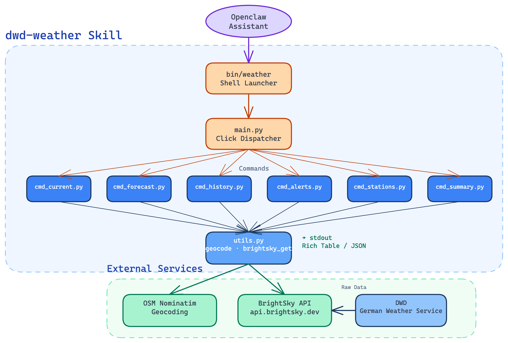

# DWD Weather CLI and Skill

A command-line weather tool powered by the [BrightSky API](https://brightsky.dev),
which provides free access to data from the **Deutscher Wetterdienst (DWD)** –
Germany's national meteorological service.

Features include current observations, multi-day forecasts, historical queries,
weather alerts, and station discovery – all by city name, with no API key required.

Works as a **standalone CLI** and as an **Openclaw skill**.

> **Openclaw Skill Setup:** see [dwd-weather/references/setup.md](dwd-weather/references/setup.md)

---

## Requirements

| Tool | Version | Install |
|------|---------|---------|
| [uv](https://docs.astral.sh/uv/) | ≥ 0.4 | `curl -LsSf https://astral.sh/uv/install.sh \| sh` |
| Python | ≥ 3.11 | managed automatically by `uv` |

---

## Installation

### Standalone (local use)

**1 – Download and unzip**

Download the latest release zip and extract it:

```bash
unzip dwd-weather-skill-*.zip
cd dwd-weather-skill
```

**2 – Install dependencies**

```bash
make install
```

**3 – Make the launcher executable**

```bash
chmod +x dwd-weather/bin/weather
```

**4 – (Optional) Add to PATH**

```bash
ln -s "$(pwd)/dwd-weather/bin/weather" ~/.local/bin/weather
```

**5 – Run**

```bash
weather current Munich
weather forecast Berlin --days 7 --daily
weather summary Hamburg
```

---

### Openclaw Skill Installation

See [dwd-weather/references/setup.md](dwd-weather/references/setup.md) for the full setup guide.

**Quick start:**

```bash
make package   # builds dwd-weather.skill_v<version>.zip
make deploy    # deploys to the Openclaw device
```

---

## Usage

All commands accept a location as free-form text (city name, address, etc.).
Geocoding is handled automatically via OpenStreetMap.

**Current weather**

```bash
weather current Munich
weather current "Frankfurt am Main" --json
```

**Forecast**

```bash
weather forecast Berlin
weather forecast Hamburg --days 7 --daily --json
```

**Historical weather**

```bash
weather history Cologne --date 2024-07-15
weather history Dresden --date 2023-06-01 --end-date 2023-06-30 --daily --json
```

**Weather alerts**

```bash
weather alerts Stuttgart
weather alerts "Berchtesgadener Land" --json
```

**Nearby stations**

```bash
weather stations Nuremberg
weather stations Bremen --radius 25 --limit 20 --json
```

**At-a-glance summary**

```bash
weather summary Freiburg
weather summary Kiel --days 10 --json
```

**Help**

```bash
weather --help
weather forecast --help
```

---

## Project Structure

```
dwd-weather-skill/
├── Makefile                        ← dev tasks: install, lint, package, deploy
├── README.md
├── images/
│   └── architecture.png            ← architecture diagram
└── dwd-weather/
    ├── pyproject.toml              ← Python project / uv configuration
    ├── SKILL.md                    ← Openclaw skill manifest
    ├── bin/
    │   └── weather                 ← shell launcher script
    ├── scripts/
    │   ├── main.py                 ← CLI entry point (Click)
    │   ├── utils.py                ← geocoding, API calls, formatting
    │   ├── cmd_current.py          ← weather current
    │   ├── cmd_forecast.py         ← weather forecast
    │   ├── cmd_history.py          ← weather history
    │   ├── cmd_alerts.py           ← weather alerts
    │   ├── cmd_stations.py         ← weather stations
    │   └── cmd_summary.py          ← weather summary
    └── references/
        └── setup.md                ← Openclaw installation guide
```

---

## Architecture



Data flow: **Openclaw** invokes `bin/weather` → `main.py` dispatches to the matching command module → each command calls `utils.py` for geocoding (OSM Nominatim) and weather data (BrightSky API) → output is written to stdout as a Rich table or JSON.

---

## Troubleshooting

| Problem | Solution |
|---------|----------|
| `command not found: weather` | Check PATH or use full path `./dwd-weather/bin/weather` |
| `Location not found` | Try a more specific name, e.g. `"Munich, Germany"` |
| `No alert data` | Alerts are only available for locations within Germany |
| `No historical data` | Not all stations have full historical records; use `weather stations` to check coverage |
| Network errors | BrightSky requires internet access; check connectivity |

For Openclaw-specific setup issues, see [dwd-weather/references/setup.md](dwd-weather/references/setup.md).

---

## Security Notes

- No API keys or credentials are required or stored.
- Geocoding requests are sent to the OpenStreetMap Nominatim API.
- All weather data is fetched from BrightSky over HTTPS.
- No user data is transmitted beyond location strings entered at the command line.

---

## Data Attribution

All data is sourced from the **Deutscher Wetterdienst (DWD)** via BrightSky.
The [DWD Terms of Use](https://www.dwd.de/EN/service/copyright/copyright_artikel.html) apply to all retrieved data.
BrightSky is free and open-source ([MIT License](https://github.com/jdemaeyer/brightsky/blob/master/LICENSE)).
Geocoding: OpenStreetMap Nominatim (© OpenStreetMap contributors).

---
## Development Notes
This codebase were generated or assisted by Claude Code  Sonnet 4.6  
All generated code has been  tested by human developers.

---
## License

MIT – see [BrightSky license](https://github.com/jdemaeyer/brightsky/blob/master/LICENSE).
DWD data is subject to the DWD Terms of Use.
